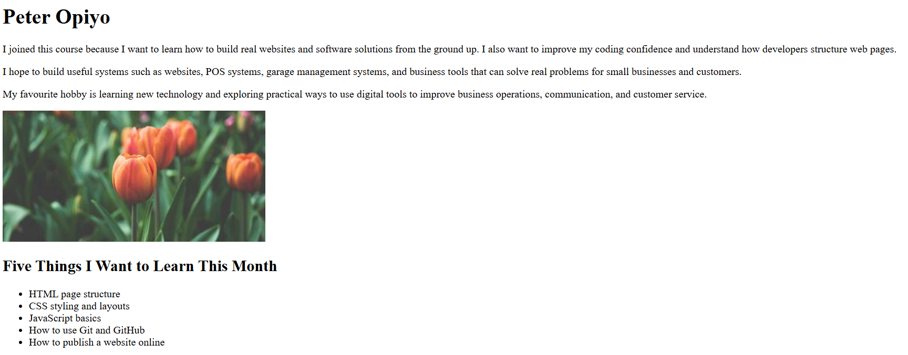
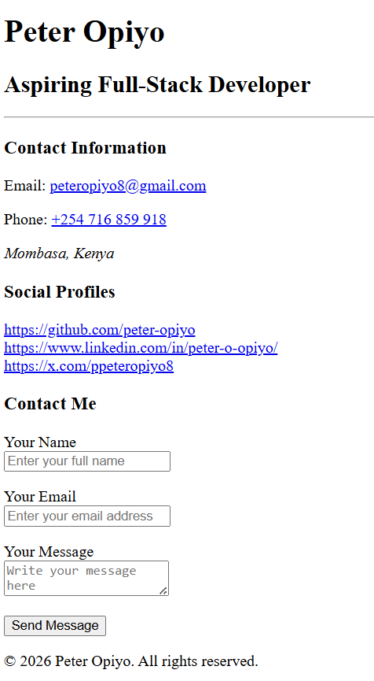
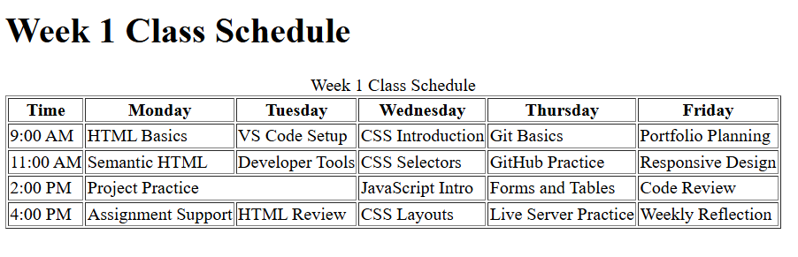

# Week 1 Day 1 Assignment: HTML from Scratch

This repository contains my Week 1 Day 1 HTML assignment.

## Files Included

- `index.html` - My first HTML page with a heading, paragraphs, image, and list.
- `business-card.html` - A semantic HTML business card with contact information, social links, and a contact form.
- `schedule.html` - A weekly class schedule built using an HTML table.

## How to Open the Project

1. Open the folder in Visual Studio Code.
2. Right-click `index.html` and select **Open with Live Server**.
3. Repeat the same for `business-card.html` and `schedule.html`.
4. Test that all pages open correctly in the browser.

## Screenshots

Add screenshots of each page below before final submission.

### Index Page

### Business Card Page

### Schedule Page

## Self-Assessment Note

I created three HTML pages using semantic HTML elements, tables, links, images, and a contact form. I tested the pages using Live Server and confirmed that they display correctly in the browser.
